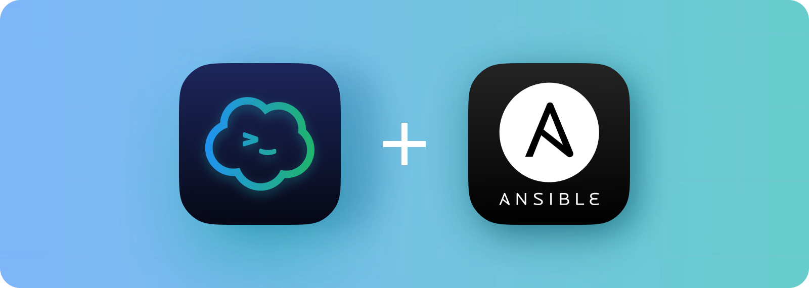

# 🌐 DevOps Automation with Ron-Tino 🚀

Welcome to **DevOps Automation with Ron-Tino**, a hands-on guide to provisioning and managing AWS EC2 instances using **Ansible**!

> _“Automate everything you can, and simplify the rest.”_ – Ron-Tino

---


## 🧠 Project Overview

This project demonstrates how to **automate the creation, configuration, and management** of Amazon EC2 instances using **Ansible**, including:

- 🛠️ Creating instances with different Linux distributions
- 🔐 Setting up passwordless SSH authentication
- 🧪 Conditional shutdown automation
- 🔒 Secure handling of credentials with Ansible Vault

---

## 🎯 Challenge

The challenge was to **automate the provisioning and management** of EC2 instances using Ansible. Specifically:

- 🔁 Create **three EC2 instances** via Ansible loops:
  - 🐧 2 Ubuntu
  - 🔵 1 CentOS
- 🔐 Set up **passwordless authentication**
- 📴 **Shutdown only Ubuntu instances** using Ansible Conditionals

---

## 📦 Prerequisites

Before diving in, ensure you have the following:

- ✅ AWS Account
- ✅ Ansible installed on your control node
- ✅ Basic AWS and Ansible knowledge
- ✅ Python and pip installed
- ✅ AWS CLI installed and configured (optional)

---

## ⚙️ Setup & Configuration

### 1️⃣ Install Required Packages

```bash
pip install boto3
ansible-galaxy collection install amazon.aws --force
2️⃣ AWS IAM Setup
Go to IAM Console in AWS.

Create a user with programmatic access.

Attach AmazonEC2FullAccess (or a more secure custom policy).

Save your access key and secret key.

🔐 For security, always prefer least privilege policies over full access.

3️⃣ Secure AWS Credentials with Ansible Vault
bash
Copy
Edit
openssl rand -base64 2048 > vault.pass
chmod 600 vault.pass
ansible-vault create group_vars/all/pass.yml --vault-password-file vault.pass
Inside pass.yml:

yaml
Copy
Edit
ec2_access_key: YOUR_ACCESS_KEY
ec2_secret_key: YOUR_SECRET_KEY
📋 EC2 Instance Creation with Ansible
🔧 ec2_create.yaml
This playbook provisions 3 EC2 instances with public IPs and custom tags.

yaml
Copy
Edit
- hosts: localhost
  connection: local
  tasks:
    - name: Start EC2 instances
      amazon.aws.ec2_instance:
        name: "{{ item.name }}"
        key_name: "rons-ec2-key"
        instance_type: t2.micro
        security_group: default
        region: us-east-1
        aws_access_key: "{{ lookup('ansible.builtin.file', 'vault.pass') }}"
        aws_secret_key: "{{ lookup('ansible.builtin.file', 'vault.pass') }}"
        network:
          assign_public_ip: true
        image_id: "{{ item.image }}"
        tags:
          environment: "{{ item.image }}"
      loop:
        - {image: "ami-084568db4383264d4", name: "managed-node-1"}
        - {image: "ami-00a929b66ed6e0de6", name: "managed-node-3"}
        - {image: "ami-084568db4383264d4", name: "managed-node-2"}
▶️ Run It!
bash
Copy
Edit
ansible-playbook ec2_create.yaml --vault-password-file vault.pass
Verify with:

bash
Copy
Edit
aws ec2 describe-instances --region us-east-1
🔑 Passwordless SSH Authentication
Update your inventory.ini:

ini
Copy
Edit
[all]
3.83.102.xxx
54.84.220.xxx
18.208.xxxxx

[redhat]
3.83.102.xx

[ubuntu]
54.84.220.xx
18.208.169.xxx
Then copy your SSH key to each instance:

bash
Copy
Edit
ssh-copy-id -i ~/.ssh/rons-ec2-key ubuntu@54.84.220.118
# Adjust for CentOS (usually ec2-user)
💡 If no keys exist, generate them with ssh-keygen and configure them on the control node and instances.

📴 Conditional Shutdown for Ubuntu
🔧 shutdown_ubuntu.yaml
yaml
Copy
Edit
- name: Shutdown ubuntu instances only
  hosts: all
  become: true

  tasks:
    - name: Shutdown ubuntu instances
      ansible.builtin.command: /sbin/shutdown -h now
      when: ansible_facts['os_family'] == "Debian"
▶️ Run It
bash
Copy
Edit
ansible-playbook shutdown_ubuntu.yaml -k
Or, if using SSH key:

bash
Copy
Edit
ansible-playbook shutdown_ubuntu.yaml --private-key ~/.ssh/rons-ec2-key
🎉 Congratulations!
You've successfully:

🎯 Automated EC2 instance provisioning

🔐 Set up passwordless SSH

🧠 Learned to use conditionals for automation

🧰 Used Ansible Vault for credential management

🧩 Next Steps
Experiment with different AMIs, instance types, and regions 🌍

Use roles and templates to modularize your playbooks 🧱

Add CI/CD automation to deploy infrastructure changes on push 🚀

Secure AWS keys with IAM roles and EC2 instance profiles 🔐

📞 Contact Me
Have questions or feedback? Reach out!
📧 tinomukuya1@gmail.com